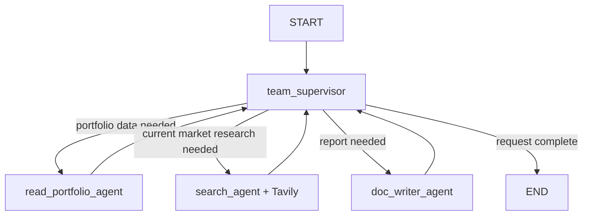

# Investment Portfolio Multi-Agent System

This project implements the investment-analysis scenario from the provided
LangGraph assignment in JavaScript. A supervisor coordinates three specialists:

- `read_portfolio_agent`: reads, validates, and summarizes a portfolio JSON file.
- `search_agent`: uses an OpenAI-powered agent with the Tavily search tool.
- `doc_writer_agent`: writes a detailed Markdown investment report.
- `team_supervisor`: uses OpenAI structured output to route work through LangGraph.

## Architecture



The generated report follows the required outline:

1. Introduction on Market Landscape
2. Portfolio Overview
3. Investment Strategy
4. Performance Analysis
5. Recommendations
6. Conclusion
7. References

## Setup

Requirements: Node.js 20 or newer, an OpenAI API key, and a Tavily API key.

```powershell
npm install
Copy-Item .env.example .env
```

Add your keys to `.env`:

```dotenv
OPENAI_API_KEY=...
TAVILY_API_KEY=...
```

## Run

### Web interface

Start the local web interface:

```powershell
npm run web
```

Then open:

```text
http://127.0.0.1:3000
```

From the page you can:

- Edit the analysis question.
- Add investments with simple form inputs: symbol, sector, quantity, price, and purchase date.
- Run the multi-agent workflow.
- Read the generated report in the browser.
- Download the report as Markdown.

The server also saves generated reports under `reports/`.

### Terminal mode

You can still run the default full analysis from the terminal:

```powershell
npm run analyze
```

Use another portfolio, question, or output location:

```powershell
npm run analyze -- --portfolio data/sample-portfolio.json --query "Analyze concentration risk and recommend a lower-risk allocation." --output reports/risk-report.md
```

Portfolio files must contain a non-empty JSON array with this shape:

```json
[
  {
    "symbol": "AAPL",
    "sector": "Technology",
    "quantity": 13,
    "purchase_price": 120.57,
    "total_invested": 1567.41,
    "purchase_date": "2022-03-12"
  }
]
```

## Verify

```powershell
npm test
npm run check
```

The report is educational analysis and is not individualized financial advice.
